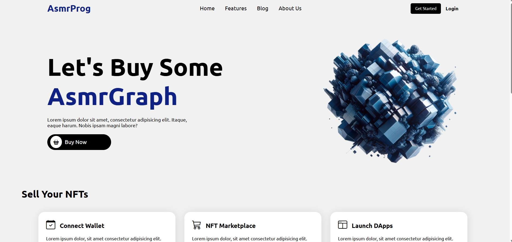

# 🌐 Projeto NFT_Website 💎

"Uma vitrine digital para o universo dos NFTs."

📖 Sobre o projeto

Este projeto foi desenvolvido durante meus estudos de HTML e CSS, com o objetivo de praticar e aprofundar os conhecimentos em estruturação de páginas e estilização visual.

O NFT_Website consiste em um site que simula uma página de vendas de NFTs (Non-Fungible Tokens), trazendo uma proposta moderna e inspirada em plataformas digitais do mercado de criptoativos.

🔗 [**Acesse o site aqui**](https://brenojramos.github.io/Projeto-Cordel/)

---

🛠️ Tecnologias utilizadas

HTML5 → Estrutura da página

CSS3 → Estilização, layout e responsividade

---

🎯 Objetivos de aprendizagem

Criar uma página com estética moderna e voltada ao tema NFT

Treinar a organização de seções e uso de grid/flexbox no CSS

Praticar a responsividade em layouts web

Simular uma vitrine digital de produtos

---

✨ Funcionalidades

Apresentação de cards representando NFTs

Estrutura de vitrine virtual

Layout visual inspirado em marketplaces de ativos digitais

Design limpo e responsivo

  

> 💡 Projeto inspirado no vídeo de [Asmr Prog](https://www.youtube.com/watch?v=lzGP_DKXMlA).
